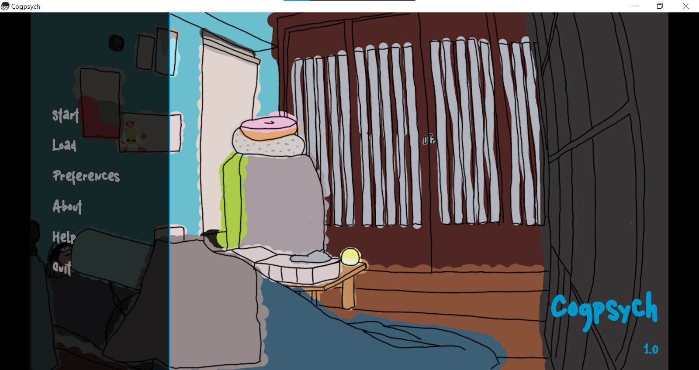
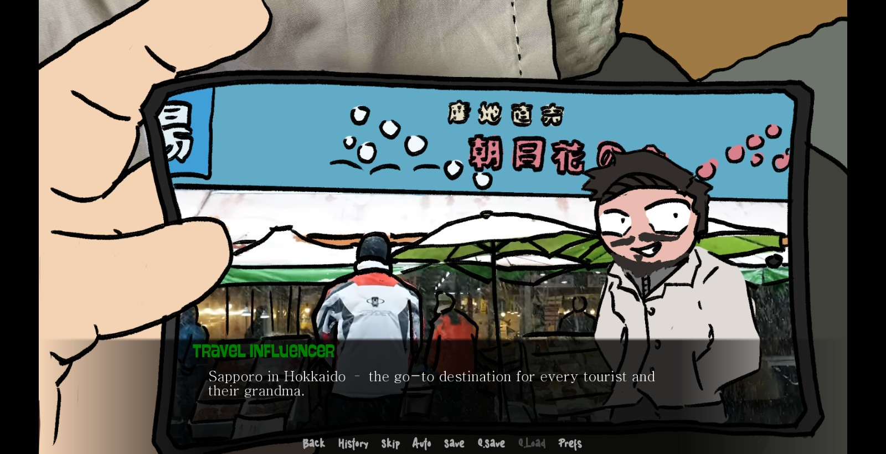
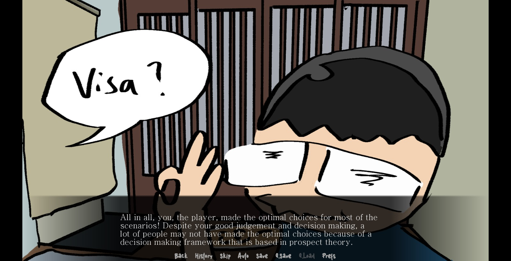
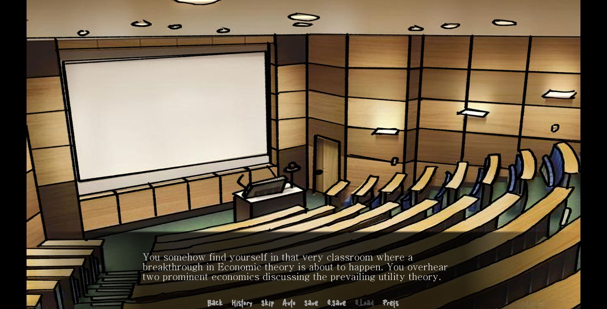
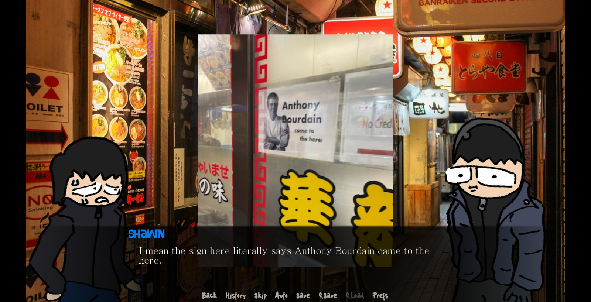

# Prospect Theory: An Interactive Visual Novel

Prospect Theory: An Interactive Visual Novel is a Ren'Py game designed to explore the psychological concepts behind decision-making. Through engaging storytelling and player choices, the game introduces the principles of prospect theory in an accessible and fun way.



## Features
- Interactive storytelling with meaningful choices
- Educational content about behavioral economics and prospect theory
- Multiple endings based on player decisions

<div align="left">
  
  
  
</div>

<div align="left">
  
  
  
</div>


## Installation
1. Clone the repository:
   ```bash
   git clone https://github.com/yourusername/cogpsych.git
   ```
2. Install [Ren'Py](https://www.renpy.org/).
3. Open the project in Ren'Py and click **Launch Project**.

## How to Play
- Make choices during the story to influence the outcome.
- Explore different scenarios that demonstrate prospect theory in action.
- Replay the game to discover alternative endings!

## License
This project is licensed under the GNU General Public License v3.0 (GPL-3.0) License. See the `LICENSE` file for details.

## Acknowledgments
- Developed using [Ren'Py](https://www.renpy.org/).
- Inspired by the works of Dan Salvato.
